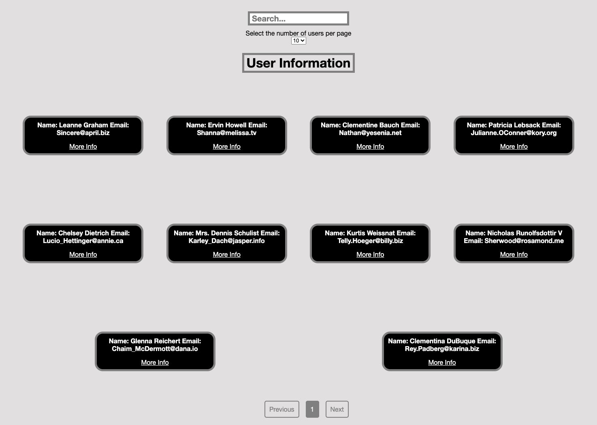

# React Self Study Project: Using an API to Display User Information
I used JSON Placeholder website: https://jsonplaceholder.typicode.com/ 'users' endpoint and axios: https://github.com/axios/axios.
To fetch a list of users data and display their information using React,React Hooks (useState, useEffect, useContex),CSS and React-Paginate: https://www.npmjs.com/package/react-paginate 
Test where written using React Testing Library and Jest 

# Goals
1: Display a user CSS cards in the homepage for each user, with their details 
2: Create a search bar at the top of the page, where you can search for users based on their names, and every time you type something, the the displayed users are filtered based on what you typed you have typed.  
3: Only display users name and email on the CSS cards on the homepage. Clicking on a CSS card you should be redirected to a new page where you will display all the information for a user 
4: Add pagination to display x number of users per page. Search filtering should still work on each page 
5: Add the option for the user to be able to select how many users they want to display per page (use select HTML element) 

https://react-users-api.netlify.app/
